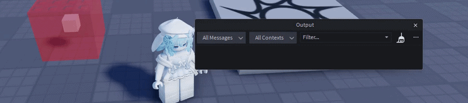

<p align="center">
  
</p>

<h1 align="center">AxeM_Hitbox v2.0 </p>

<p align="center">
  <strong>AxeM_Hitbox</strong> is a high-precision modular hitbox system for Roblox. It is designed for developers who prioritize performance, clean code, and flexible hit registration.
</p>

<p align="center">
  The module is fully optimized for <strong>Rojo</strong> and modern development in VS Code.
</p>

<p align="center">
  <a href="https://create.roblox.com/store/asset/131038870784326/AxeMHitboxV20">
    
  </a>
</p>

---

## 🛠️ Key Features

| Feature | Description |
| :--- | :--- |
| **⚡ High Precision** | Runs at a frequency of 0.01s (customizable) to catch even the fastest attacks. |
| **🧠 Smart Filtering** | Automatically ignores accessories, environmental objects, and dead characters. |
| **🚀 Optimization** | `OverlapParams` are initialized only once, minimizing server load. |
| **🎯 3 Registration Modes** | Choose between single hit, cooldown-based, or continuous detection. |
| **👁️ Visualization** | Built-in debug mode to adjust zone sizes and visibility in real-time. |

---

## 🕹️ Touch Modes (TouchMode)

The following demonstrations show how the different registration modes work:

### 1. Single
Registers a hit on a model only once during the hitbox's lifetime or activation period.
> 

### 2. Cooldown
Registers repeat hits on the same target only after the `TouchCooldown` period expires.
> 

### 3. Always
Registers hits every single frame the hitbox is active (every PollRate).
> 

---

## 💻 USAGE EXAMPLE

```lua
local AxeM_Hitbox = require(game.ReplicatedStorage.Module.AxeMHitbox.Core)

local hitbox = AxeM_Hitbox.new({                                
    AnchorPart = script.Parent,      --> The part the box is attached to
    Size = Vector3.new(4, 6, 4),     --> Size of the zone
    Visible = true,                  --> Enable visualization
    TouchMode = "cooldown",          --> Set mode to "cooldown"
    TouchCooldown = 0.5,             --> 0.5 second delay
    OnModelTouched = function(model, hb, part)
        print("Hit registered on: " .. model.Name)            
    end                                                                     
})                                                                          

hitbox:Enable() -- Activate the hitbox
